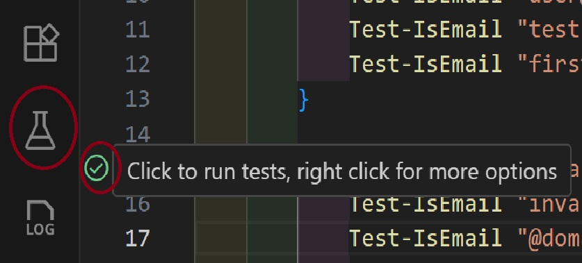
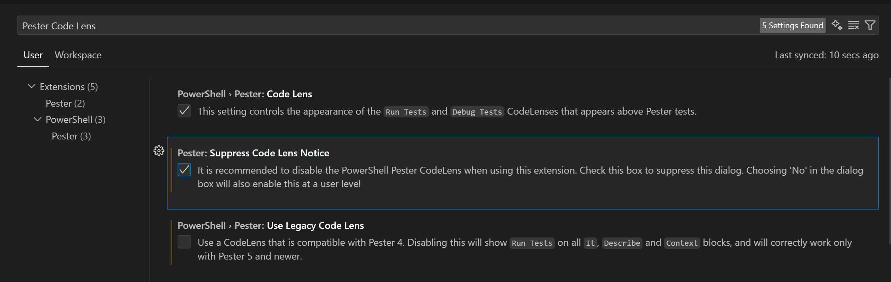
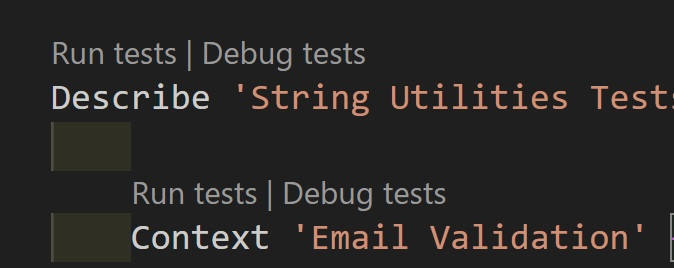

# Lab 7: VS Code Testing Integration with Pester

## Lab Overview

In this lab, you'll learn how to integrate Pester tests with VS Code's built-in Test Explorer. You'll master:

- **VS Code Test Explorer setup** for Pester tests
- **Running tests directly from VS Code** without command line
- **Test discovery and navigation** in large projects
- **Debugging tests** with VS Code debugger
- **Test result visualization** and reporting

> Official Reference: For the authoritative guide on using Pester inside VS Code (test discovery, CodeLens, debugging, configuration), see the Pester documentation: https://pester.dev/docs/usage/vscode

## Prerequisites

- PowerShell 7.4 or later
- Pester v5.7.1 or later
- VS Code with PowerShell extension
- Labs 1-6 completion

## Lab Setup

### Step 1: VS Code Extensions

Ensure you have the required extensions installed:

1. **PowerShell Extension** (ms-vscode.powershell)
2. **Test Explorer UI** (hbenl.vscode-test-explorer)
3. **PowerShell Test Explorer** (TylerLeonhardt.vscode-pester-test-adapter)

Install missing extensions:
```
code --install-extension ms-vscode.powershell
code --install-extension hbenl.vscode-test-explorer
code --install-extension TylerLeonhardt.vscode-pester-test-adapter
```

### Step 2: Project Structure

Create a sample project structure that VS Code can discover:

```
VSCodeTestingLab/
├── src/
│   ├── Calculator.ps1
│   └── StringUtils.ps1
├── tests/
│   ├── Calculator.Tests.ps1
│   └── StringUtils.Tests.ps1
├── .vscode/
│   └── settings.json
└── PesterConfig.ps1
```

### Step 3: Sample Code Files

Create `src/Calculator.ps1`:

```powershell
class Calculator {
    [double] Add([double] $a, [double] $b) {
        return $a + $b
    }
    
    [double] Subtract([double] $a, [double] $b) {
        return $a - $b
    }
    
    [double] Multiply([double] $a, [double] $b) {
        return $a * $b
    }
    
    [double] Divide([double] $a, [double] $b) {
        if ($b -eq 0) {
            throw "Cannot divide by zero"
        }
        return $a / $b
    }
    
    [double] Power([double] $base, [double] $exponent) {
        return [Math]::Pow($base, $exponent)
    }
}

function New-Calculator {
    return [Calculator]::new()
}
```

Create `src/StringUtils.ps1`:

```powershell
function Test-IsEmail {
    param([string] $Email)
    
    if ([string]::IsNullOrWhiteSpace($Email)) {
        return $false
    }
    
    return $Email -match '^[a-zA-Z0-9._%+-]+@[a-zA-Z0-9.-]+\.[a-zA-Z]{2,}$'
}

function Format-PhoneNumber {
    param([string] $PhoneNumber)
    
    # Remove all non-digits
    $digits = $PhoneNumber -replace '\D', ''
    
    if ($digits.Length -eq 10) {
        return "($($digits.Substring(0,3))) $($digits.Substring(3,3))-$($digits.Substring(6,4))"
    }
    elseif ($digits.Length -eq 11 -and $digits.StartsWith('1')) {
        return "+1 ($($digits.Substring(1,3))) $($digits.Substring(4,3))-$($digits.Substring(7,4))"
    }
    else {
        throw "Invalid phone number format"
    }
}

function Get-Initials {
    param([string] $FullName)
    
    if ([string]::IsNullOrWhiteSpace($FullName)) {
        return ""
    }
    
    $words = $FullName.Split(' ', [StringSplitOptions]::RemoveEmptyEntries)
    $initials = $words | ForEach-Object { $_.Substring(0, 1).ToUpper() }
    
    return $initials -join ''
}
```

### Step 4: Test Files

Create `tests/Calculator.Tests.ps1`:

```powershell
BeforeAll {
    # Import the module
    . "$PSScriptRoot/../src/Calculator.ps1"
}

Describe 'Calculator Class Tests' {
    BeforeEach {
        $script:calc = New-Calculator
    }
    
    Context 'Basic Operations' {
        It 'Should add two numbers correctly' {
            $result = $calc.Add(5, 3)
            $result | Should -Be 8
        }
        
        It 'Should subtract two numbers correctly' {
            $result = $calc.Subtract(10, 4)
            $result | Should -Be 6
        }
        
        It 'Should multiply two numbers correctly' {
            $result = $calc.Multiply(7, 8)
            $result | Should -Be 56
        }
        
        It 'Should handle negative numbers' {
            $calc.Add(-5, 3) | Should -Be -2
            $calc.Subtract(-10, -4) | Should -Be -6
            $calc.Multiply(-3, 4) | Should -Be -12
        }
    }
    
    Context 'Division Operations' {
        It 'Should divide two numbers correctly' {
            $result = $calc.Divide(15, 3)
            $result | Should -Be 5
        }
        
        It 'Should handle decimal division' {
            $result = $calc.Divide(7, 2)
            $result | Should -Be 3.5
        }
        
        It 'Should throw error when dividing by zero' {
            { $calc.Divide(10, 0) } | Should -Throw "Cannot divide by zero"
        }
    }
    
    Context 'Advanced Operations' {
        It 'Should calculate power correctly' {
            $calc.Power(2, 3) | Should -Be 8
            $calc.Power(5, 2) | Should -Be 25
            $calc.Power(10, 0) | Should -Be 1
        }
        
        It 'Should handle fractional exponents' {
            $result = $calc.Power(9, 0.5)
            $result | Should -Be 3
        }
    }
}
```

Create `tests/StringUtils.Tests.ps1`:

```powershell
BeforeAll {
    # Import the module
    . "$PSScriptRoot/../src/StringUtils.ps1"
}

Describe 'String Utilities Tests' {
    
    Context 'Email Validation' {
        It 'Should validate correct email addresses' {
            Test-IsEmail "user@example.com" | Should -Be $true
            Test-IsEmail "test.email+tag@domain.co.uk" | Should -Be $true
            Test-IsEmail "firstname.lastname@company.org" | Should -Be $true
        }
        
        It 'Should reject invalid email addresses' {
            Test-IsEmail "invalid.email" | Should -Be $false
            Test-IsEmail "@domain.com" | Should -Be $false
            Test-IsEmail "user@" | Should -Be $false
            Test-IsEmail "" | Should -Be $false
            Test-IsEmail $null | Should -Be $false
        }
    }
    
    Context 'Phone Number Formatting' {
        It 'Should format 10-digit phone numbers' {
            $result = Format-PhoneNumber "1234567890"
            $result | Should -Be "(123) 456-7890"
        }
        
        It 'Should format 11-digit phone numbers with country code' {
            $result = Format-PhoneNumber "11234567890"
            $result | Should -Be "+1 (123) 456-7890"
        }
        
        It 'Should handle phone numbers with existing formatting' {
            $result = Format-PhoneNumber "(123) 456-7890"
            $result | Should -Be "(123) 456-7890"
        }
        
        It 'Should throw error for invalid phone numbers' {
            { Format-PhoneNumber "123" } | Should -Throw "Invalid phone number format"
            { Format-PhoneNumber "12345678901234" } | Should -Throw "Invalid phone number format"
        }
    }
    
    Context 'Initials Generation' {
        It 'Should generate initials from full name' {
            Get-Initials "John Doe" | Should -Be "JD"
            Get-Initials "Jane Mary Smith" | Should -Be "JMS"
            Get-Initials "Bob" | Should -Be "B"
        }
        
        It 'Should handle edge cases' {
            Get-Initials "" | Should -Be ""
            Get-Initials "  " | Should -Be ""
            Get-Initials "john doe" | Should -Be "JD"  # Should capitalize
        }
        
        It 'Should handle multiple spaces' {
            Get-Initials "John   Doe   Smith" | Should -Be "JDS"
        }
    }
}
```

### Step 5: VS Code Configuration

Create `.vscode/settings.json`:

```json
{
    "powershell.pester.useLegacyCodeLens": false,
    "powershell.pester.outputVerbosity": "Detailed",
    "testExplorer.useNativeTesting": true,
    "powershell.integratedConsole.showOnStartup": false,
    "files.associations": {
        "*.Tests.ps1": "powershell"
    },
    "test.defaultGutterClickAction": "run"
}
```

Create `PesterConfig.ps1`:

```powershell
# Pester configuration for VS Code integration
$PesterPreference = [PesterConfiguration]::Default

# Output settings for VS Code
$PesterPreference.Output.Verbosity = 'Detailed'
$PesterPreference.Run.Exit = $false
$PesterPreference.TestResult.Enabled = $true
$PesterPreference.TestResult.OutputFormat = 'NUnitXml'
$PesterPreference.TestResult.OutputPath = './TestResults.xml'

# Code coverage settings
$PesterPreference.CodeCoverage.Enabled = $true
$PesterPreference.CodeCoverage.Path = './src/*.ps1'
$PesterPreference.CodeCoverage.OutputFormat = 'CoverageGutters'
$PesterPreference.CodeCoverage.OutputPath = './coverage.xml'

Export-ModuleMember -Variable PesterPreference
```

## Lab Exercises

### Exercise 1: VS Code Test Discovery

1. **Open the project in VS Code**:
   ```bash
   code VSCodeTestingLab
   ```

2. **Enable Test Explorer**:
   - Open Command Palette (`Ctrl+Shift+P`)
   - Type "Test: Focus on Test Explorer View"
   - The Test Explorer should appear in the sidebar if not already there



3. **Discover Tests**:
   - VS Code should automatically discover your `.Tests.ps1` files
   - If not, click the refresh button in Test Explorer
   - You should see a tree structure with your test files and individual tests

### Exercise 2: Running Tests from VS Code

1. **Run Individual Tests**:
   - Click the play button next to any individual test
   - Observe the results in the Test Explorer
   - Check the output panel for detailed results

2. **Run Test Suites**:
   - Click the play button next to a `Describe` block
   - Run all tests in a file by clicking the file-level play button

3. **Run All Tests**:
   - Click the play button at the top of Test Explorer
   - Watch all tests execute

### Exercise 3: Test Navigation and CodeLens

1. **Navigate to Tests**:
   - Select a Test in Test Explorer and press Alt+Enter to go to that test.
   - VS Code should open the test file and navigate to the test
   - Alternatively you can right-click on the test to go to the context menu.


2. **Use CodeLens**:
   - First make sure Pester and Powershell Extensions are configured for Pester v5 Code Lens support: https://pester.dev/docs/usage/vscode#code-lens
   - Open VSCode Settings with: Ctrl +, and search for "Pester Code Lens"
   
   - Open a `.Tests.ps1` file
   - You should see "Run Test" and "Debug Test" links above each test
   - Click these to run individual tests



3. **Navigate to Source**:
   - Use `Ctrl+Click` on function names in tests to jump to source code

### Exercise 4: Debugging Tests

1. **Set Breakpoints**:
   - Open `src/Calculator.ps1`
   - Set a breakpoint in the `Divide` method (click in the gutter)

2. **Debug a Test**:
   - In Test Explorer, right-click on the "Should throw error when dividing by zero" test
   - Select "Debug Test"
   - The debugger should stop at your breakpoint

3. **Inspect Variables**:
   - Examine variables in the Debug Console
   - Use the Variables panel to inspect the call stack

### Exercise 5: Test Results and Reporting

1. **View Test Results**:
   - After running tests, check the Test Explorer for pass/fail status
   - Click on failed tests to see error details

2. **Problems Panel**:
   - Failed tests appear in the Problems panel (`Ctrl+Shift+M`)
   - Click on problems to navigate to failing tests

3. **Output Panel**:
   - Select "PowerShell Extension" in the Output panel dropdown
   - View detailed test execution logs

### Exercise 6: Continuous Testing

1. **Enable Auto-Run**:
   - In Test Explorer, click the "Auto Run" button
   - Tests will automatically run when you save files

2. **Watch Mode**:
   - Make a change to `Calculator.ps1`
   - Save the file
   - Observe tests automatically running

3. **Test on Change**:
   - Modify a test to make it fail
   - Save and watch the Test Explorer update

## Advanced Features

### Code Coverage Integration

1. **Install Coverage Gutters Extension**:
   ```bash
   code --install-extension ryanluker.vscode-coverage-gutters
   ```

2. **Run Tests with Coverage**:
   ```powershell
   Invoke-Pester -Configuration $PesterPreference
   ```

3. **View Coverage**:
   - Command Palette: "Coverage Gutters: Display Coverage"
   - See line-by-line coverage in your source files

### Custom Test Configuration

Create a custom test runner script `RunTests.ps1`:

```powershell
param(
    [string]$TestPath = "./tests/*.Tests.ps1",
    [switch]$Coverage,
    [switch]$Detailed
)

$config = [PesterConfiguration]::Default
$config.Run.Path = $TestPath
$config.Output.Verbosity = if ($Detailed) { 'Detailed' } else { 'Normal' }
$config.TestResult.Enabled = $true
$config.TestResult.OutputPath = './TestResults.xml'

if ($Coverage) {
    $config.CodeCoverage.Enabled = $true
    $config.CodeCoverage.Path = './src/*.ps1'
}

Invoke-Pester -Configuration $config
```

### VS Code Tasks Integration

Create `.vscode/tasks.json`:

```json
{
    "version": "2.0.0",
    "tasks": [
        {
            "label": "Run All Tests",
            "type": "shell",
            "command": "pwsh",
            "args": ["-File", "./RunTests.ps1"],
            "group": {
                "kind": "test",
                "isDefault": true
            },
            "presentation": {
                "echo": true,
                "reveal": "always",
                "focus": false,
                "panel": "shared"
            }
        },
        {
            "label": "Run Tests with Coverage",
            "type": "shell",
            "command": "pwsh",
            "args": ["-File", "./RunTests.ps1", "-Coverage"],
            "group": "test",
            "presentation": {
                "echo": true,
                "reveal": "always",
                "focus": false,
                "panel": "shared"
            }
        }
    ]
}
```

Run tasks with `Ctrl+Shift+P` → "Tasks: Run Task"

## Key Learning Points

### 1. Test Discovery
VS Code automatically finds tests using naming conventions:
- Files ending in `.Tests.ps1`
- `Describe`, `Context`, and `It` blocks

### 2. Test Navigation
- Test Explorer provides hierarchical view
- CodeLens enables quick test execution
- Easy navigation between tests and source code

### 3. Debugging Integration
- Set breakpoints in test files or source code
- Full debugging capabilities during test execution
- Variable inspection and call stack analysis

### 4. Continuous Testing
- Auto-run tests on file changes
- Immediate feedback on code modifications
- Integration with VS Code's file watching

### 5. Result Visualization
- Clear pass/fail indicators
- Detailed error messages
- Integration with Problems panel

## Troubleshooting

### Common Issues:

1. **Tests Not Discovered**:
   - Ensure PowerShell extension is installed and active
   - Check that test files follow naming convention
   - Restart VS Code if needed

2. **Test Explorer Not Showing**:
   - Install Test Explorer UI extension
   - Enable via Command Palette: "Test: Focus on Test Explorer View"

3. **CodeLens Not Working**:
   - Check `powershell.pester.useLegacyCodeLens` setting
   - Ensure file is recognized as PowerShell

4. **Debugging Not Working**:
   - Verify PowerShell extension is active
   - Check that breakpoints are in valid locations
   - Ensure test is run in debug mode, not regular run mode

## Summary

This Lab 7 teaches you:
- ✅ How to integrate Pester tests with VS Code Test Explorer
- ✅ Running and debugging tests directly from VS Code
- ✅ Test discovery and navigation in large projects
- ✅ Continuous testing and auto-run capabilities
- ✅ Advanced features like code coverage and custom tasks

VS Code integration makes testing more accessible and efficient for PowerShell development!

## Next Steps
- Set up automated testing in your projects
- Explore advanced VS Code testing extensions
- Create custom test configurations for different scenarios
- Integrate with CI/CD pipelines from Lab 6

---
**Estimated Time**: 60-75 minutes  
**Difficulty**: Intermediate to Advanced
